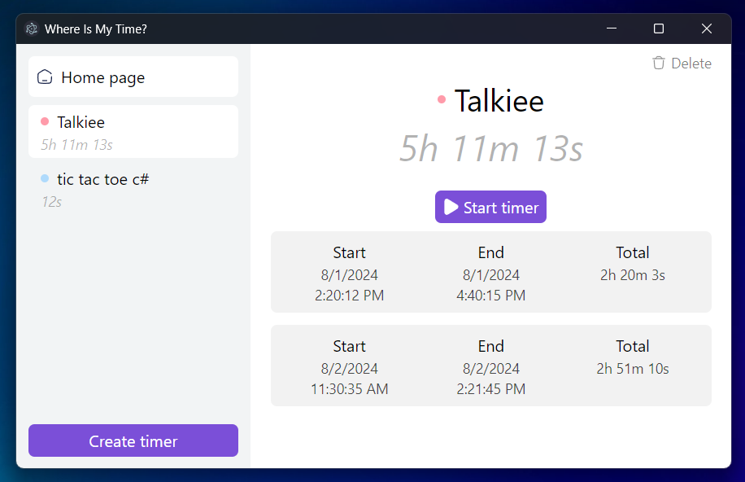

# Where Is My Time?

## Description
Do you know how much time you spent developing the project? Or is it necessary to track the time spent on a particular action by day? Then this program is made for you. The purpose of the program is to keep track of the time spent and show you statistics.

The following technologies were used when writing the application: Electron, Vite, React, TypeScript, Zustand

## Feature
* Creating/deleting a timer
* Setting a custom color and name for each timer
* Display of timer operation periods (Start time, End time, Amount of time spent)
* Local data storage

## Instaling
[Download](https://github.com/danya0/whereismytime/releases/tag/beta) latest version. Unzip the contents of the archive, and run the executable file (.exe)
